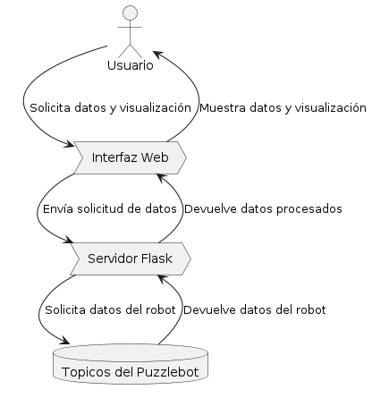
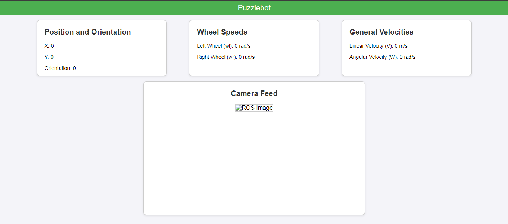

# PuzzlebotInterface
This repository contains everything you need and shows an example of how to present robot data in a Web interface. 
To do this we mainly use ROS which helps us with the communication of all the nodes and elements of our system.
The web server is made in python with Flask library.

## Plant 
Following is the DFD which was made using PlantUML:

## Image of the Interface Web

## Video
[Video](https://drive.google.com/file/d/1dp2-_n516ufPrpkmeGWZHNcvxWas6eZO/view?usp=sharing)

## Team
Hector Ruben Cortes - A00831592
José Edgar Hernández Cancino Estrada - A00827269                                                            
Carlos David Olan Olvera - A01611252
Luis Carlos Olave Vera - A01233810
Félix Alfonso Torres Rodríguez - A00829771
